# BÁO CÁO DỰ ÁN

## **ỨNG DỤNG XỬ LÝ ẢNH VÀ THỊ GIÁC MÁY TÍNH**

### _Computer Vision Application - Eagle Eye CV Master_

---

**Sinh viên thực hiện:** Nguyễn Huy Hưng  
**Mã sinh viên:** 22110135  
**Lớp:** BCSE2022  
**Giảng viên hướng dẫn:** Bùi Huy Kiên  
**Năm học:** 2025 - 2026

---

## Mục lục

1. [Giới thiệu](#1-giới-thiệu)
2. [Cơ sở lý thuyết và Chức năng](#2-cơ-sở-lý-thuyết-và-chức-năng)
   - [2.1. Thao tác cơ bản](#21-thao-tác-cơ-bản)
   - [2.2. Biến đổi hình học](#22-biến-đổi-hình-học-geometric-transformations)
   - [2.3. Cải thiện ảnh trong miền không gian](#23-cải-thiện-ảnh-trong-miền-không-gian-spatial-domain-enhancement)
   - [2.4. Cải thiện ảnh trong miền tần số](#24-cải-thiện-ảnh-trong-miền-tần-số-frequency-domain-enhancement)
   - [2.5. Khôi phục ảnh](#25-khôi-phục-ảnh-image-restoration)
   - [2.6. Xử lý hình thái học](#26-xử-lý-hình-thái-học-morphological-processing)
   - [2.7. Phân đoạn ảnh](#27-phân-đoạn-ảnh-image-segmentation)
   - [2.8. Nén ảnh](#28-nén-ảnh-image-compression)
   - [2.9. Nhận dạng khuôn mặt với PCA](#29-nhận-dạng-khuôn-mặt-với-pca-face-recognition-using-pca)
3. [Demo ứng dụng](#3-demo-ứng-dụng)
4. [Công nghệ sử dụng](#4-công-nghệ-sử-dụng)
5. [Kết luận](#5-kết-luận)
6. [Tài liệu tham khảo](#6-tài-liệu-tham-khảo)

---

## 1. Giới thiệu

### 1.1. Lý do chọn đề tài

Trong quá trình học tập môn **Thị giác máy tính** (Computer Vision), em nhận thấy rằng các kiến thức lý thuyết được giảng dạy trên lớp rất phong phú và sâu rộng. Tuy nhiên, việc chỉ học lý thuyết mà không có thực hành sẽ khiến kiến thức trở nên trừu tượng và khó nhớ. Chính vì vậy, em đã quyết định xây dựng một ứng dụng hoàn chỉnh để:

- **Củng cố kiến thức:** Việc tự tay implement các thuật toán giúp hiểu sâu hơn về nguyên lý hoạt động của từng kỹ thuật xử lý ảnh.
- **Trực quan hóa kết quả:** Một ứng dụng có giao diện đồ họa (GUI) cho phép quan sát trực tiếp tác động của các tham số lên hình ảnh, từ đó nắm bắt được ý nghĩa thực tiễn của các công thức toán học.
- **Tích hợp toàn diện:** Thay vì các đoạn code rời rạc, một ứng dụng tích hợp sẽ giúp thấy được mối liên hệ giữa các kỹ thuật khác nhau trong pipeline xử lý ảnh.
- **Nâng cao kỹ năng lập trình:** Phát triển một ứng dụng hoàn chỉnh đòi hỏi kỹ năng tổ chức code, thiết kế kiến trúc phần mềm và xử lý tương tác người dùng.

### 1.2. Mục tiêu dự án

Xây dựng một ứng dụng minh họa và thực thi các thuật toán xử lý ảnh từ cơ bản đến nâng cao, bao gồm:

- Các phép biến đổi điểm ảnh (point operations)
- Các bộ lọc trong miền không gian và miền tần số
- Các phép toán hình thái học
- Phân đoạn ảnh và nén ảnh
- Nhận dạng khuôn mặt sử dụng PCA (Eigenfaces)

---

## 2. Cơ sở lý thuyết và Chức năng

### 2.1. Thao tác cơ bản

#### 2.1.1. Biểu diễn ảnh số (Digital Image Representation)

Ảnh số được biểu diễn dưới dạng ma trận 2 chiều $f(x, y)$, trong đó mỗi phần tử đại diện cho cường độ sáng (intensity) của điểm ảnh tại tọa độ $(x, y)$. Đối với ảnh màu RGB, mỗi pixel được biểu diễn bởi 3 kênh màu (Red, Green, Blue).

**Các chức năng đã implement:**

- Đọc/ghi ảnh với nhiều định dạng (PNG, JPG, BMP, TIFF, PGM)
- Chuyển đổi không gian màu: RGB ↔ Grayscale, HSV, LAB

#### 2.1.2. Histogram

Histogram $h(r_k)$ của ảnh biểu diễn phân bố tần suất của các mức xám trong ảnh:

$$h(r_k) = n_k$$

Trong đó $n_k$ là số lượng pixel có giá trị cường độ $r_k$.

**Histogram chuẩn hóa (Normalized Histogram):**

$$p(r_k) = \frac{n_k}{MN}$$

với $M \times N$ là kích thước ảnh.

**Chức năng đã implement:**

- Hiển thị và phân tích histogram của ảnh
- Hỗ trợ cả ảnh grayscale và ảnh màu (hiển thị histogram cho từng kênh)

#### 2.1.3. Cân bằng Histogram (Histogram Equalization)

Cân bằng histogram nhằm tăng cường độ tương phản của ảnh bằng cách làm phẳng phân bố histogram. Công thức biến đổi:

$$s_k = T(r_k) = (L-1) \sum_{j=0}^{k} p(r_j)$$

Trong đó $L$ là số mức xám (thường là 256).

#### 2.1.4. Lấy mẫu và Lượng tử hóa (Sampling & Quantization)

- **Lấy mẫu (Sampling):** Quyết định độ phân giải không gian của ảnh
- **Lượng tử hóa (Quantization):** Quyết định số mức xám được sử dụng để biểu diễn ảnh

Ứng dụng hỗ trợ thay đổi độ phân giải (resize) và quan sát tác động của việc giảm số mức xám.

---

### 2.2. Biến đổi hình học (Geometric Transformations)

Các phép biến đổi hình học thay đổi vị trí không gian của các pixel trong ảnh.

#### 2.2.1. Phép xoay (Rotation)

Xoay ảnh quanh một điểm tâm với góc $\theta$:

$$\begin{bmatrix} x' \\ y' \end{bmatrix} = \begin{bmatrix} \cos\theta & -\sin\theta \\ \sin\theta & \cos\theta \end{bmatrix} \begin{bmatrix} x \\ y \end{bmatrix}$$

**Chức năng đã implement:**

- Xoay ảnh với góc bất kỳ
- Tùy chọn giữ nguyên kích thước hoặc mở rộng để chứa toàn bộ ảnh

#### 2.2.2. Phép co giãn (Scaling)

Thay đổi kích thước ảnh theo tỷ lệ:

$$\begin{bmatrix} x' \\ y' \end{bmatrix} = \begin{bmatrix} s_x & 0 \\ 0 & s_y \end{bmatrix} \begin{bmatrix} x \\ y \end{bmatrix}$$

- $s_x, s_y > 1$: Phóng to
- $s_x, s_y < 1$: Thu nhỏ

#### 2.2.3. Phép lật (Flip)

- **Lật ngang (Horizontal Flip):** $x' = width - x - 1$
- **Lật dọc (Vertical Flip):** $y' = height - y - 1$

#### 2.2.4. Phép dịch chuyển (Translation)

Dịch chuyển ảnh theo vector $(t_x, t_y)$:

$$\begin{bmatrix} x' \\ y' \end{bmatrix} = \begin{bmatrix} x \\ y \end{bmatrix} + \begin{bmatrix} t_x \\ t_y \end{bmatrix}$$

#### 2.2.5. Phép nghiêng (Shear)

Biến đổi nghiêng theo trục x hoặc y:

$$\begin{bmatrix} x' \\ y' \end{bmatrix} = \begin{bmatrix} 1 & sh_x \\ sh_y & 1 \end{bmatrix} \begin{bmatrix} x \\ y \end{bmatrix}$$

---

### 2.3. Cải thiện ảnh trong miền không gian (Spatial Domain Enhancement)

#### 2.3.1. Các phép biến đổi điểm ảnh (Point Operations)

**Phép âm bản (Negative):**
$$s = (L - 1) - r$$

**Biến đổi Logarithm:**
$$s = c \cdot \log(1 + r)$$

Kỹ thuật này mở rộng các giá trị pixel tối và nén các giá trị sáng, hữu ích cho việc hiển thị phổ Fourier.

**Biến đổi Gamma (Power-law Transform):**
$$s = c \cdot r^{\gamma}$$

- $\gamma < 1$: Làm sáng ảnh (mở rộng vùng tối)
- $\gamma > 1$: Làm tối ảnh (nén vùng tối)

**Điều chỉnh độ sáng (Brightness):**
$$s = r + b$$

Trong đó $b$ là giá trị điều chỉnh (-255 đến 255).

**Điều chỉnh độ tương phản (Contrast):**
$$s = 128 + c \cdot (r - 128)$$

Trong đó $c$ là hệ số tương phản (0 đến 3).

#### 2.3.2. Bộ lọc tuyến tính (Linear Filters)

**Bộ lọc trung bình (Mean/Box Filter):**

Thay thế mỗi pixel bằng giá trị trung bình của các pixel lân cận:

$$g(x,y) = \frac{1}{mn} \sum_{(s,t) \in S_{xy}} f(s,t)$$

**Bộ lọc Gaussian:**

Sử dụng kernel Gaussian để làm mịn ảnh:

$$G(x,y) = \frac{1}{2\pi\sigma^2} e^{-\frac{x^2+y^2}{2\sigma^2}}$$

Bộ lọc Gaussian hiệu quả hơn bộ lọc trung bình trong việc bảo toàn cạnh.

#### 2.3.3. Bộ lọc phi tuyến (Non-linear Filters)

**Bộ lọc Median:**

Thay thế mỗi pixel bằng giá trị trung vị của các pixel lân cận. Đặc biệt hiệu quả trong việc loại bỏ nhiễu muối tiêu (salt & pepper noise) trong khi vẫn bảo toàn cạnh tốt hơn các bộ lọc tuyến tính.

**Bộ lọc Bilateral:**

Bộ lọc bilateral kết hợp cả thông tin không gian và cường độ để làm mịn ảnh trong khi vẫn bảo toàn cạnh:

$$g(x,y) = \frac{\sum_{(s,t)} f(s,t) \cdot w_s(x,y,s,t) \cdot w_r(f(x,y), f(s,t))}{\sum_{(s,t)} w_s \cdot w_r}$$

Trong đó:

- $w_s$: Trọng số không gian (Gaussian theo khoảng cách)
- $w_r$: Trọng số cường độ (Gaussian theo độ chênh lệch màu)

#### 2.3.4. Làm sắc nét ảnh (Image Sharpening)

**Bộ lọc Laplacian:**

Laplacian là toán tử đạo hàm bậc hai:

$$\nabla^2 f = \frac{\partial^2 f}{\partial x^2} + \frac{\partial^2 f}{\partial y^2}$$

Kernel Laplacian phổ biến:
$$\begin{bmatrix} 0 & 1 & 0 \\ 1 & -4 & 1 \\ 0 & 1 & 0 \end{bmatrix}$$

**Unsharp Masking:**
$$g(x,y) = f(x,y) + k \cdot [f(x,y) - f_{blur}(x,y)]$$

---

### 2.4. Cải thiện ảnh trong miền tần số (Frequency Domain Enhancement)

#### 2.4.1. Biến đổi Fourier rời rạc (DFT)

Biến đổi Fourier 2D của ảnh $f(x,y)$ kích thước $M \times N$:

$$F(u,v) = \sum_{x=0}^{M-1} \sum_{y=0}^{N-1} f(x,y) e^{-j2\pi(\frac{ux}{M} + \frac{vy}{N})}$$

Biến đổi ngược:
$$f(x,y) = \frac{1}{MN} \sum_{u=0}^{M-1} \sum_{v=0}^{N-1} F(u,v) e^{j2\pi(\frac{ux}{M} + \frac{vy}{N})}$$

**Chức năng đã implement:**

- Tính toán và hiển thị phổ biên độ (magnitude spectrum)
- Dịch chuyển zero-frequency về tâm để dễ quan sát

#### 2.4.2. Bộ lọc thông thấp (Low-pass Filters)

Loại bỏ các thành phần tần số cao, giữ lại tần số thấp → làm mịn ảnh.

**Bộ lọc lý tưởng (Ideal LPF):**
$$H(u,v) = \begin{cases} 1 & \text{if } D(u,v) \leq D_0 \\ 0 & \text{if } D(u,v) > D_0 \end{cases}$$

**Bộ lọc Butterworth:**
$$H(u,v) = \frac{1}{1 + [D(u,v)/D_0]^{2n}}$$

**Bộ lọc Gaussian:**
$$H(u,v) = e^{-D^2(u,v)/2D_0^2}$$

Trong đó $D(u,v)$ là khoảng cách từ điểm $(u,v)$ đến tâm, $D_0$ là tần số cắt.

#### 2.4.3. Bộ lọc thông cao (High-pass Filters)

Loại bỏ các thành phần tần số thấp, giữ lại tần số cao → làm nổi bật cạnh và chi tiết.

$$H_{HP}(u,v) = 1 - H_{LP}(u,v)$$

**Các loại bộ lọc thông cao đã implement:**

- Ideal High-pass Filter
- Butterworth High-pass Filter
- Gaussian High-pass Filter

---

### 2.5. Khôi phục ảnh (Image Restoration)

#### 2.5.1. Mô hình nhiễu (Noise Models)

**Nhiễu đồng nhất (Uniform Noise):**
$$p(z) = \frac{1}{b-a} \text{ với } a \leq z \leq b$$

**Nhiễu Rayleigh:**
$$p(z) = \frac{2}{b}(z-a)e^{-(z-a)^2/b} \text{ với } z \geq a$$

**Nhiễu hàm mũ (Exponential Noise):**
$$p(z) = ae^{-az} \text{ với } z \geq 0$$

**Nhiễu Gaussian:**
$$p(z) = \frac{1}{\sqrt{2\pi}\sigma}e^{-(z-\mu)^2/2\sigma^2}$$

**Nhiễu muối tiêu (Salt & Pepper):**
$$p(z) = \begin{cases} P_a & \text{cho } z = a \\ P_b & \text{cho } z = b \\ 0 & \text{otherwise} \end{cases}$$

#### 2.5.2. Bộ lọc trung bình (Mean Filters)

**Trung bình số học (Arithmetic Mean):**
$$\hat{f}(x,y) = \frac{1}{mn} \sum_{(s,t) \in S_{xy}} g(s,t)$$

**Trung bình hình học (Geometric Mean):**
$$\hat{f}(x,y) = \left[ \prod_{(s,t) \in S_{xy}} g(s,t) \right]^{1/mn}$$

**Trung bình điều hòa (Harmonic Mean):**
$$\hat{f}(x,y) = \frac{mn}{\sum_{(s,t) \in S_{xy}} \frac{1}{g(s,t)}}$$

**Trung bình nghịch điều hòa (Contra-harmonic Mean):**
$$\hat{f}(x,y) = \frac{\sum_{(s,t) \in S_{xy}} g(s,t)^{Q+1}}{\sum_{(s,t) \in S_{xy}} g(s,t)^Q}$$

#### 2.5.3. Bộ lọc thứ tự (Order-Statistics Filters)

- **Median Filter:** Giá trị trung vị
- **Max Filter:** Giá trị lớn nhất (tốt cho nhiễu pepper)
- **Min Filter:** Giá trị nhỏ nhất (tốt cho nhiễu salt)
- **Midpoint Filter:** $(max + min) / 2$
- **Alpha-trimmed Mean:** Loại bỏ $d/2$ giá trị lớn nhất và nhỏ nhất, tính trung bình phần còn lại

#### 2.5.4. Bộ lọc thích nghi (Adaptive Filters)

**Bộ lọc thích nghi cục bộ (Local Adaptive Filter):**
$$\hat{f}(x,y) = g(x,y) - \frac{\sigma_\eta^2}{\sigma_L^2}[g(x,y) - m_L]$$

**Bộ lọc trung vị thích nghi (Adaptive Median):** Tự động điều chỉnh kích thước cửa sổ dựa trên đặc điểm nhiễu cục bộ.

#### 2.5.5. Mô hình suy giảm và khôi phục (Degradation Models)

**Nhòe chuyển động (Motion Blur):**

Tạo kernel chuyển động theo chiều dài và góc cho trước.

**Nhiễu loạn khí quyển (Atmospheric Turbulence):**
$$H(u,v) = e^{-k(u^2 + v^2)^{5/6}}$$

**Lọc nghịch đảo (Inverse Filter):**
$$\hat{F}(u,v) = \frac{G(u,v)}{H(u,v)}$$

**Lọc Wiener:**
$$\hat{F}(u,v) = \frac{H^*(u,v)}{|H(u,v)|^2 + K} \cdot G(u,v)$$

Trong đó $K$ là tỷ lệ nhiễu trên tín hiệu (NSR).

#### 2.5.6. Bộ lọc Notch (Notch Filter)

Loại bỏ nhiễu tuần hoàn tại các tần số cụ thể trong miền tần số. Bộ lọc chắn Notch được tạo bởi:

$$H_{NR}(u,v) = \prod_{k=1}^{Q} H_k(u,v) \cdot H_{-k}(u,v)$$

Trong đó mỗi $H_k$ là bộ lọc thông cao tập trung tại tần số nhiễu $(u_k, v_k)$ và điểm đối xứng $(-u_k, -v_k)$.

---

### 2.6. Xử lý hình thái học (Morphological Processing)

Các phép toán hình thái học làm việc trên ảnh nhị phân (binary) hoặc grayscale với phần tử cấu trúc (structuring element - SE).

#### 2.6.1. Phép co (Erosion)

$$A \ominus B = \{z | (B)_z \subseteq A\}$$

Co làm thu nhỏ các vùng sáng, loại bỏ các chi tiết nhỏ.

#### 2.6.2. Phép dãn (Dilation)

$$A \oplus B = \{z | (\hat{B})_z \cap A \neq \emptyset\}$$

Dãn làm mở rộng các vùng sáng, lấp đầy các lỗ nhỏ.

#### 2.6.3. Phép mở (Opening)

$$A \circ B = (A \ominus B) \oplus B$$

Mở = Co rồi Dãn. Loại bỏ các chi tiết sáng nhỏ hơn SE trong khi giữ nguyên hình dạng tổng thể.

#### 2.6.4. Phép đóng (Closing)

$$A \bullet B = (A \oplus B) \ominus B$$

Đóng = Dãn rồi Co. Lấp đầy các lỗ nhỏ và kết nối các vùng gần nhau.

**Các phép toán nâng cao đã implement:**

- Gradient hình thái học
- Top-hat và Black-hat transform
- Trích xuất biên (Boundary extraction)
- Tạo bộ xương (Skeletonization)

---

### 2.7. Phân đoạn ảnh (Image Segmentation)

#### 2.7.1. Phân ngưỡng toàn cục (Global Thresholding)

$$g(x,y) = \begin{cases} 1 & \text{if } f(x,y) > T \\ 0 & \text{if } f(x,y) \leq T \end{cases}$$

#### 2.7.2. Phân ngưỡng Otsu (Otsu's Method)

Phương pháp Otsu tự động tìm ngưỡng tối ưu bằng cách tối đa hóa phương sai giữa các lớp (between-class variance):

$$\sigma_B^2(t) = \omega_0(t)\omega_1(t)[\mu_0(t) - \mu_1(t)]^2$$

Ngưỡng tối ưu: $T^* = \arg\max_t \sigma_B^2(t)$

#### 2.7.3. Phân ngưỡng thích nghi (Adaptive Thresholding)

Tính ngưỡng riêng cho từng vùng nhỏ trong ảnh, phù hợp với ảnh có độ sáng không đồng đều.

#### 2.7.4. Phân cụm K-Means (K-Means Clustering)

Thuật toán phân cụm không giám sát chia ảnh thành $K$ vùng dựa trên đặc trưng màu sắc:

1. Khởi tạo $K$ tâm cụm ngẫu nhiên
2. Gán mỗi pixel vào cụm có tâm gần nhất
3. Cập nhật tâm cụm
4. Lặp lại bước 2-3 đến khi hội tụ

#### 2.7.5. Phân đoạn Watershed

Thuật toán watershed xem ảnh như một bề mặt địa hình và "ngập nước" từ các điểm cực tiểu. Các đường phân thủy tạo thành biên giới giữa các vùng.

#### 2.7.6. Phát triển vùng (Region Growing)

Bắt đầu từ một điểm hạt giống (seed point), thuật toán mở rộng vùng bằng cách thêm các pixel lân cận có cường độ tương tự:

- Kiểm tra 4-connected hoặc 8-connected neighbors
- So sánh cường độ với ngưỡng cho phép
- Lặp lại cho đến khi không còn pixel nào thỏa mãn

---

### 2.8. Nén ảnh (Image Compression)

#### 2.8.1. Nén không mất dữ liệu (Lossless Compression)

**Mã hóa Huffman:**
Xây dựng mã có độ dài thay đổi dựa trên tần suất xuất hiện của các ký hiệu. Ký hiệu xuất hiện nhiều hơn được gán mã ngắn hơn.

**Mã hóa Run-Length (RLC):**
Biểu diễn chuỗi các giá trị giống nhau liên tiếp bằng cặp (giá trị, số lần lặp).

#### 2.8.2. Nén mất dữ liệu - JPEG/DCT

Ứng dụng mô phỏng quy trình nén JPEG để giáo dục:

**Bước 1: Chia ảnh thành các khối 8×8**

**Bước 2: Biến đổi DCT 2D**

Biến đổi Cosine rời rạc chuyển khối pixel sang miền tần số:

$$F(u,v) = \frac{1}{4}C(u)C(v)\sum_{x=0}^{7}\sum_{y=0}^{7}f(x,y)\cos\frac{(2x+1)u\pi}{16}\cos\frac{(2y+1)v\pi}{16}$$

**Bước 3: Lượng tử hóa**

Chia các hệ số DCT cho bảng lượng tử hóa JPEG chuẩn và làm tròn:
$$F_Q(u,v) = round\left(\frac{F(u,v)}{Q(u,v)}\right)$$

**Bước 4: Mã hóa Zig-zag**

Sắp xếp các hệ số theo đường zig-zag để nhóm các hệ số gần 0 về cuối, thuận tiện cho RLC.

**Chức năng demo đã implement:**

- Trực quan hóa từng bước DCT
- Điều chỉnh chất lượng nén (1-100)
- Phân tích khối 8×8 bất kỳ bằng click chuột
- So sánh ảnh gốc và ảnh sau nén

---

### 2.9. Nhận dạng khuôn mặt với PCA (Face Recognition using PCA)

#### 2.9.1. Phân tích thành phần chính (PCA)

PCA là kỹ thuật giảm chiều dữ liệu bằng cách tìm các hướng (principal components) có phương sai lớn nhất.

**Các bước thực hiện:**

1. **Chuẩn hóa dữ liệu:** Tính khuôn mặt trung bình (mean face) và trừ đi từ mỗi ảnh
   $$\Phi_i = \Gamma_i - \Psi$$
2. **Tính ma trận hiệp phương sai:**
   $$C = \frac{1}{M}\sum_{i=1}^{M}\Phi_i\Phi_i^T = AA^T$$
3. **Tính eigenvectors và eigenvalues** của C

4. **Chọn K eigenvectors** tương ứng với K eigenvalues lớn nhất → **Eigenfaces**

#### 2.9.2. Eigenfaces

Eigenfaces là các eigenvector của ma trận hiệp phương sai, đại diện cho các đặc trưng cơ bản của khuôn mặt. Mỗi khuôn mặt có thể được biểu diễn như tổ hợp tuyến tính của các eigenfaces:

$$\Gamma = \Psi + \sum_{i=1}^{K} w_i u_i$$

Trong đó $w_i$ là trọng số (weights) và $u_i$ là eigenface thứ $i$.

#### 2.9.3. Tái tạo khuôn mặt (Face Reconstruction)

Cho phép tái tạo khuôn mặt với số lượng thành phần chính khác nhau để quan sát:

- Với ít thành phần: Ảnh mờ, chỉ giữ đặc trưng chung
- Với nhiều thành phần: Ảnh chi tiết hơn, gần với ảnh gốc

**Chức năng đã implement:**

- Tải bộ dữ liệu khuôn mặt từ cấu trúc thư mục
- Tính toán và hiển thị mean face
- Hiển thị các eigenfaces
- Tái tạo khuôn mặt với số thành phần tùy chỉnh
- So sánh ảnh gốc và ảnh tái tạo

---

## 3. Demo ứng dụng

Phần này trình bày giao diện và các chức năng chính của ứng dụng thông qua ảnh chụp màn hình.

### 3.1. Giao diện chính

Ứng dụng được thiết kế với giao diện thân thiện người dùng, sử dụng dark theme hiện đại. Giao diện chính bao gồm: thanh menu, vùng hiển thị ảnh gốc và ảnh đã xử lý (đồng bộ zoom/pan), và các tab chức năng bên phải.

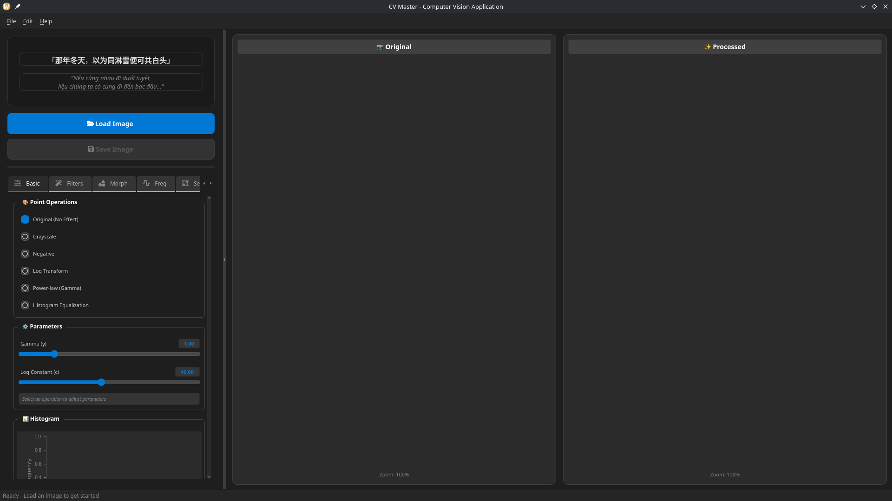

---

### 3.2. Thao tác cơ bản và Histogram

Chức năng này cho phép người dùng tải ảnh, chuyển đổi không gian màu, và phân tích histogram. Histogram được hiển thị trực quan giúp đánh giá phân bố cường độ sáng của ảnh.

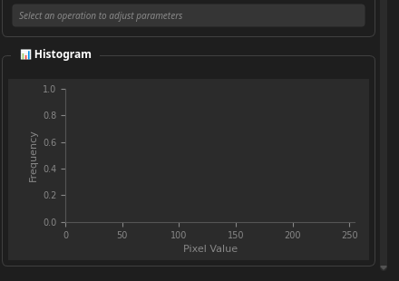

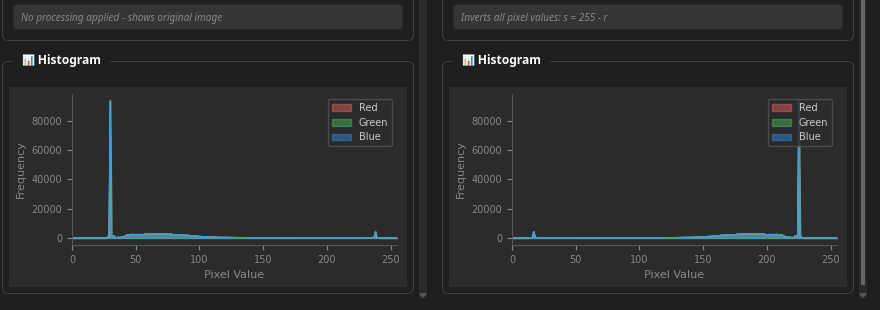

---

### 3.3. Bộ lọc trong miền không gian

Giao diện tab Filters cho phép áp dụng các bộ lọc làm mịn (Mean, Gaussian, Median, Bilateral) và làm sắc nét (Laplacian, Unsharp Mask) với các tham số có thể điều chỉnh.

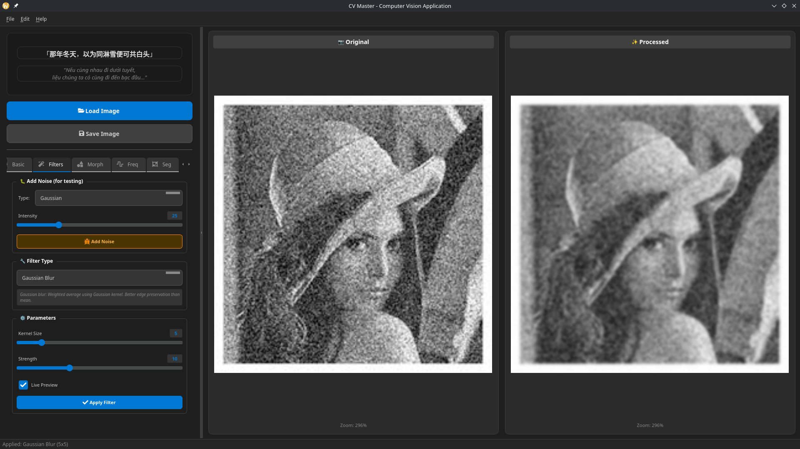

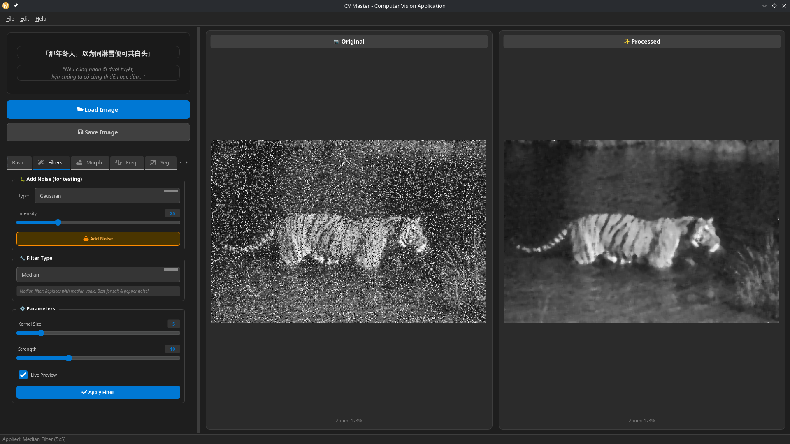

---

### 3.4. Xử lý trong miền tần số

Tab Frequency Domain hiển thị phổ Fourier và cho phép áp dụng các bộ lọc thông thấp/thông cao với nhiều loại bộ lọc khác nhau (Ideal, Butterworth, Gaussian).


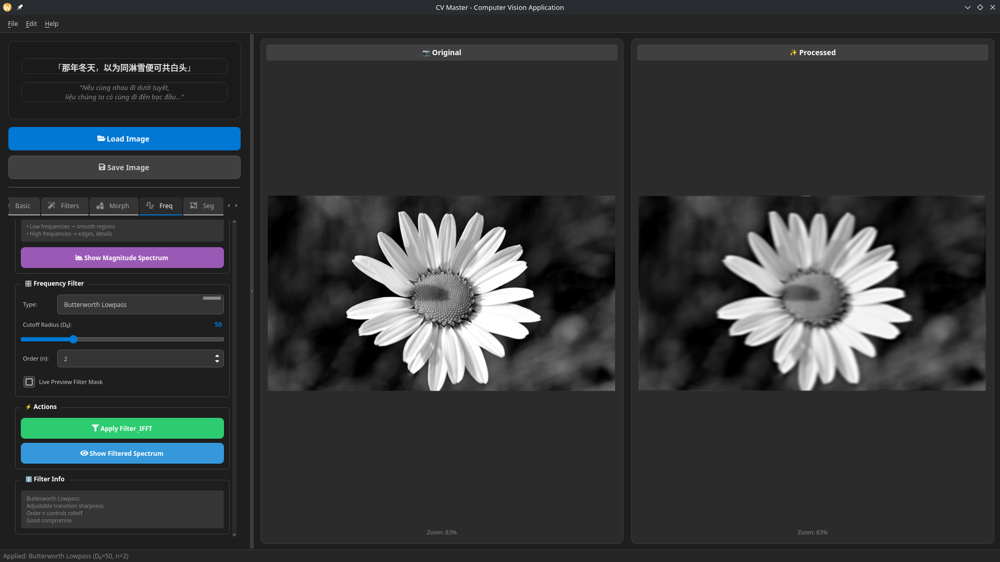

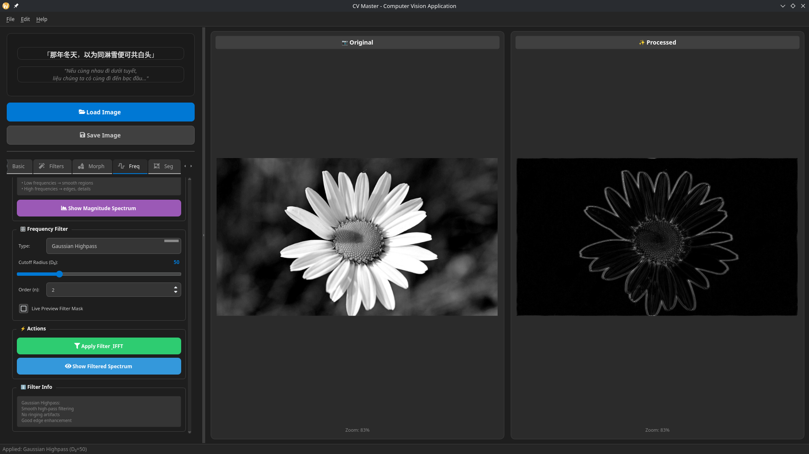

---

### 3.5. Khôi phục ảnh

Tab Restoration cho phép thêm các loại nhiễu khác nhau vào ảnh và sau đó áp dụng các bộ lọc khử nhiễu để quan sát hiệu quả.

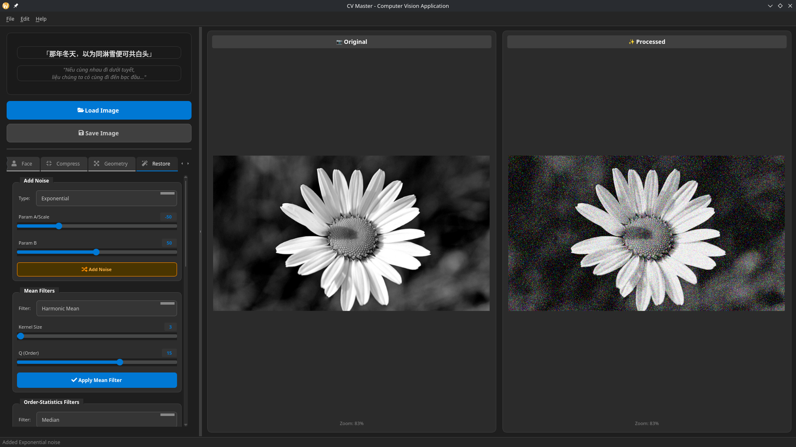

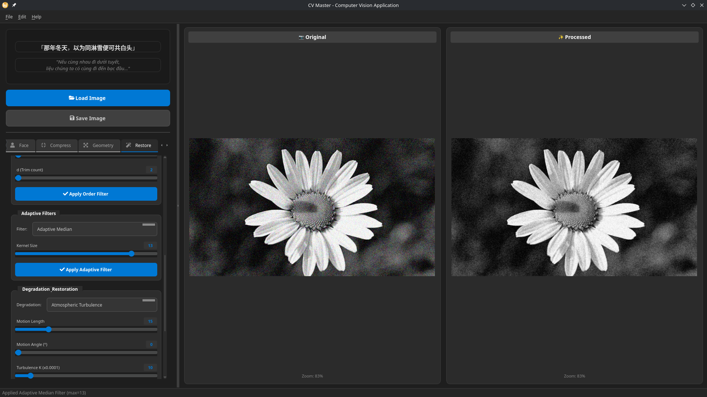

---

### 3.6. Xử lý hình thái học

Tab Morphology cung cấp các phép toán hình thái học cơ bản và nâng cao trên ảnh nhị phân.

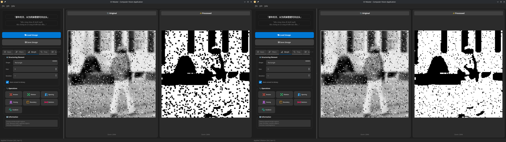

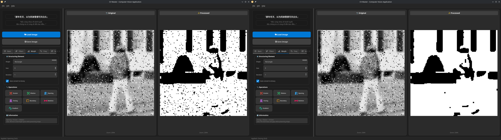

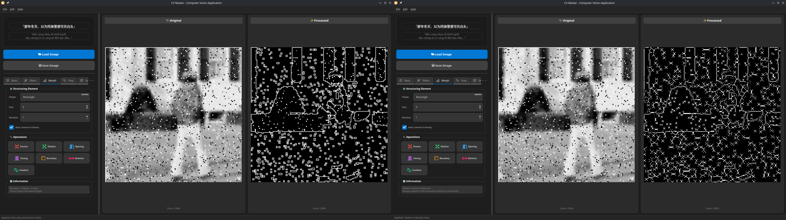

---

### 3.7. Phân đoạn ảnh

Tab Segmentation cho phép phân ngưỡng ảnh với nhiều phương pháp và phân cụm K-Means.


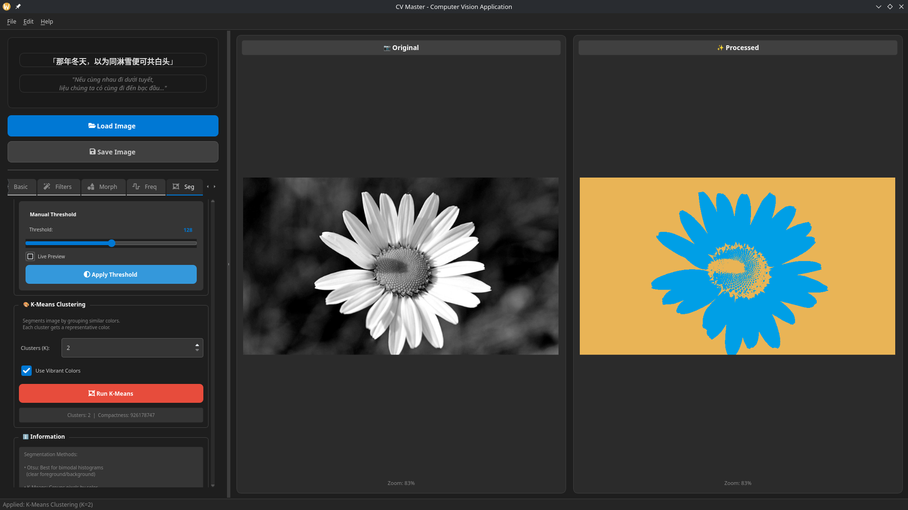

---

### 3.8. Nén ảnh JPEG

Tab Compression mô phỏng quy trình nén JPEG với khả năng phân tích từng khối 8×8.

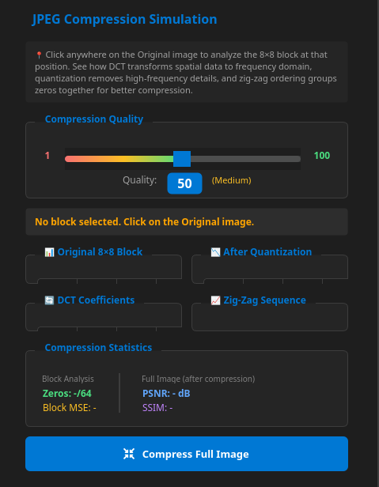

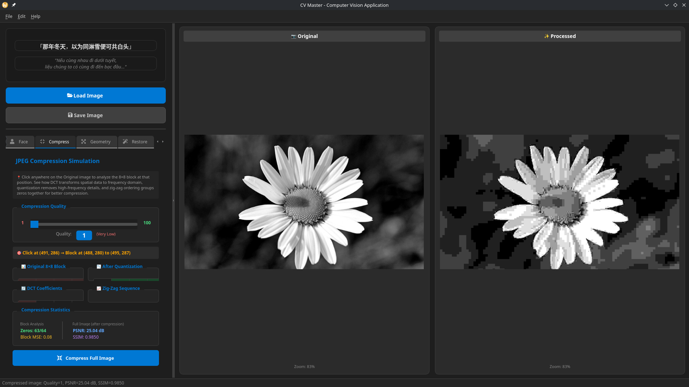

---

### 3.9. Nhận dạng khuôn mặt PCA

Tab PCA Face Recognition thực hiện nhận dạng khuôn mặt sử dụng phương pháp Eigenfaces.

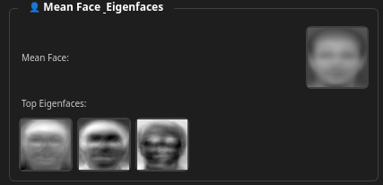

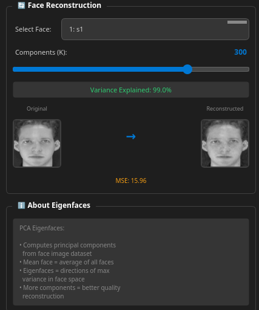

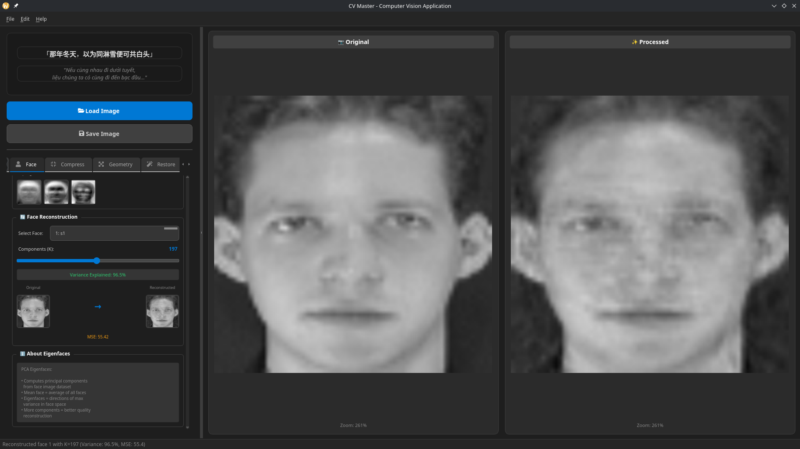

---

## 4. Công nghệ sử dụng

### 4.1. Ngôn ngữ lập trình

| Công nghệ  | Phiên bản | Mô tả                    |
| ---------- | --------- | ------------------------ |
| **Python** | 3.12+     | Ngôn ngữ lập trình chính |

### 4.2. Framework và Thư viện

| Thư viện         | Phiên bản | Mục đích sử dụng                                     |
| ---------------- | --------- | ---------------------------------------------------- |
| **PySide6**      | 6.10.1    | Framework GUI (Qt6 bindings for Python)              |
| **OpenCV**       | 4.11.0    | Xử lý ảnh cơ bản và nâng cao                         |
| **NumPy**        | 2.3.5     | Tính toán ma trận và số học                          |
| **SciPy**        | 1.16.3    | Các thuật toán khoa học (filters, signal processing) |
| **scikit-image** | 0.25.2    | Các thuật toán xử lý ảnh bổ sung                     |
| **scikit-learn** | 1.7.2     | Machine learning (K-Means clustering)                |
| **Matplotlib**   | 3.10.7    | Vẽ biểu đồ và histogram                              |
| **QtAwesome**    | 1.4.0     | Icon font cho giao diện                              |
| **qdarktheme**   | 2.1.0     | Dark theme cho Qt                                    |

### 4.3. Công cụ phát triển

- **Visual Studio Code** - IDE chính
- **Git** - Quản lý phiên bản
- **uv** - Python package manager

### 4.4. Kiến trúc phần mềm

Ứng dụng được tổ chức theo kiến trúc module hóa:

```
computer-vision-app/
├── main.py              # Entry point
├── core/                # Core algorithms
│   ├── point.py         # Point operations
│   ├── filters.py       # Spatial filters
│   ├── frequency.py     # Frequency domain
│   ├── morphology.py    # Morphological ops
│   ├── segmentation.py  # Segmentation
│   ├── compression.py   # JPEG compression
│   ├── restoration.py   # Image restoration
│   ├── pca.py           # PCA/Eigenfaces
│   └── worker.py        # Background processing
├── ui/                  # User interface
│   ├── main_window.py   # Main window
│   ├── image_viewer.py  # Image display
│   ├── *_tab.py         # Feature tabs
│   └── ...
└── data/                # Sample datasets
    └── archive/         # Face dataset (ORL)
```

---

## 5. Kết luận

### 5.1. Những kiến thức đã học được

Thông qua việc xây dựng ứng dụng này, em đã thu được nhiều kiến thức và kỹ năng quý báu:

#### Về mặt lý thuyết:

1. **Hiểu sâu về biểu diễn ảnh số:** Cách máy tính lưu trữ và xử lý ảnh, ý nghĩa của từng pixel và các không gian màu khác nhau.

2. **Nắm vững các phép biến đổi điểm ảnh:** Hiểu rõ tác động của các hàm biến đổi (log, gamma, histogram equalization) lên chất lượng hình ảnh.

3. **Phân biệt xử lý miền không gian và miền tần số:** Khi nào nên dùng bộ lọc spatial, khi nào nên chuyển sang frequency domain để xử lý hiệu quả hơn.

4. **Hiểu nguyên lý các thuật toán phân đoạn:** Từ phương pháp đơn giản (thresholding) đến phức tạp (K-Means clustering).

5. **Nắm được quy trình nén JPEG:** Tại sao DCT được sử dụng, vai trò của bảng lượng tử hóa, và cách zig-zag encoding tối ưu hóa việc nén.

6. **Hiểu PCA và ứng dụng trong nhận dạng:** Eigenfaces là một ứng dụng tuyệt vời của đại số tuyến tính trong computer vision.

#### Về mặt thực hành:

1. **Kỹ năng lập trình Python nâng cao:** Sử dụng NumPy một cách hiệu quả cho tính toán ma trận, vectorization thay vì loop.

2. **Thiết kế giao diện người dùng:** Xây dựng GUI responsive với PySide6/Qt6, xử lý events và signals.

3. **Kiến trúc phần mềm:** Tổ chức code theo module, tách biệt logic xử lý và giao diện.

4. **Xử lý bất đồng bộ:** Sử dụng worker threads để không block UI khi xử lý ảnh lớn.

5. **Debug và tối ưu:** Học cách profile code, tìm bottleneck và tối ưu performance.

### 5.2. Khó khăn và giải pháp

- **Khó khăn:** PCA với ảnh lớn tốn nhiều bộ nhớ và thời gian tính toán.
- **Giải pháp:** Sử dụng trick tính eigenvector trên ma trận nhỏ hơn khi số sample < số feature.

- **Khó khăn:** Giao diện bị freeze khi xử lý ảnh lớn.
- **Giải pháp:** Implement QThread worker để xử lý background.

### 5.3. Hướng phát triển

- Thêm các thuật toán deep learning cho object detection và semantic segmentation
- Hỗ trợ xử lý video real-time
- Thêm chức năng so sánh nhiều thuật toán cùng lúc
- Xây dựng chế độ tutorial tương tác

### 5.4. Lời kết

Dự án này không chỉ giúp em củng cố kiến thức lý thuyết từ môn học mà còn rèn luyện khả năng áp dụng kiến thức vào thực tế. Việc tự tay implement các thuật toán đã giúp em hiểu sâu hơn về bản chất của xử lý ảnh, thay vì chỉ sử dụng các hàm có sẵn từ thư viện. Em xin chân thành cảm ơn giảng viên đã hướng dẫn và tạo điều kiện để em hoàn thành dự án này.

---

## 6. Tài liệu tham khảo

1. Gonzalez, R. C., & Woods, R. E. (2018). _Digital Image Processing_ (4th ed.). Pearson.

2. Szeliski, R. (2022). _Computer Vision: Algorithms and Applications_ (2nd ed.). Springer.

3. Turk, M., & Pentland, A. (1991). Eigenfaces for recognition. _Journal of Cognitive Neuroscience_, 3(1), 71-86.

4. OpenCV Documentation. https://docs.opencv.org/

5. Qt for Python Documentation. https://doc.qt.io/qtforpython/

6. NumPy Documentation. https://numpy.org/doc/

7. Bài giảng môn Thị giác máy tính - VJU

---

_Báo cáo được hoàn thành vào tháng 12 năm 2025_
